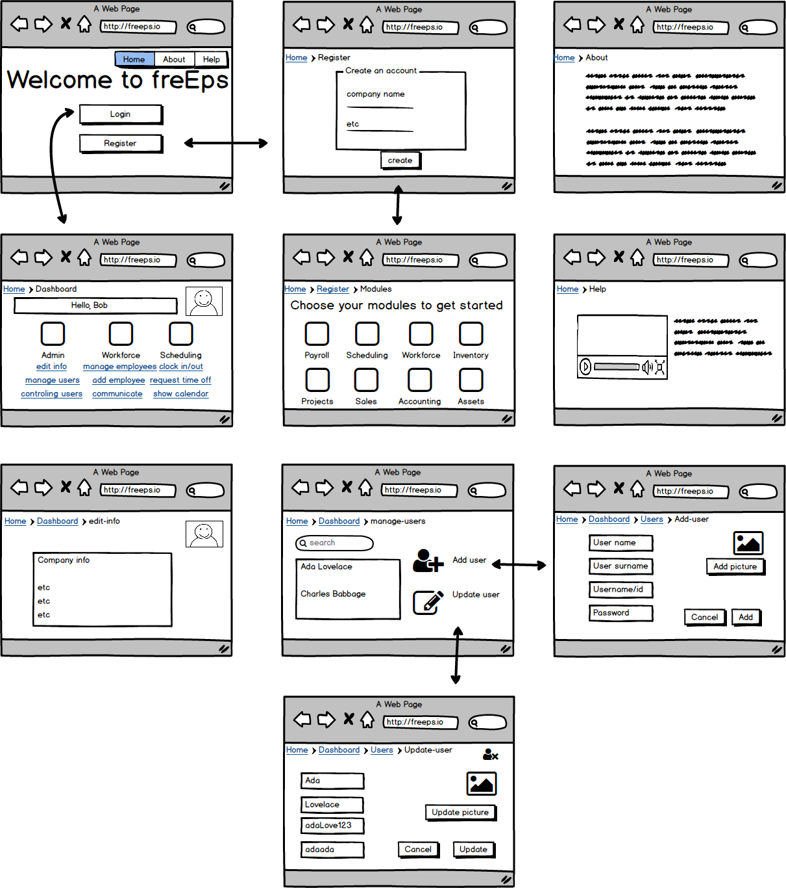

# freEPS
An open-source, scalable enterprise portal software suite

## Team

  - __Product Owner__: David d'Aquin
  - __Scrum Master__: Nathan Donolli
  - __Creative Director__: Živilė Janulevičiūtė Goodwin

## Table of Contents

1. [About](#about)
2. [Getting Started](#getting-started)
  2. [Setting up an account](#setting-up-an-account)
  2. [Wireframe](#wireframe)
3. [Architecture](#architecture)
  3. [Skeleton](#skeleton)
  3. [Database](#database)
  3. [Tech Stack](#tech-stack)
4. [Development](#development)
  4. [Installing Dependencies](#installing-dependencies)
  4. [Creating Custom Modules](#creating-custom-modules)
5. [Contributing](#contributing)
  5. [About Open Source](#about-open-source)
  5. [Submitting Pull Requests](#submitting-pull-requests)
  5. [License Info](#license-info)

## <a name="about"></a> About

freEPS is a free-to-use enterprise planning software program for your business or organization.  With freEPS, you can manage your workforce, inventory, or sales accounts all through one centralized portal. freEPS is web-based, so you can handle all business related activity without ever leaving your computer's browser or installing extra software.

freEPS is designed to cater to your business' needs, offering a customizable module system that can grow with your organization.  You can sign up with freEPS through our hosted service or download and host our software yourself for free!

## <a name="getting-started"></a> Getting Started

Let's imagine you are twelve time Grammy-Award winning musician Bob Dylan. You have just won the Nobel Prize in Literature and have decided to now open up a small toy shop. You hear talks of this new service called "freEPS" blowin' in the wind and decide to sign up with freEPS to manage your new business.  Now what?

### <a name="setting-up-an-account"></a>Setting up an account

The easiest way for you to start using freEPS is by signing up through our website at freeps.io. There you can find more

### <a name="wireframe"></a>Wireframe
#### Admin


#### Workforce


#### Scheduling


## <a name="architecture"></a>Architecture

freEPS revolves around two things: it's modularity and it's database.

freEPS will utilize two databases: a mongoDB or similar (noSQL) database to
store things such as data for clients/companies, as well as user permissions and
auth. A sql or relational database will be used to hold everything else.

Individual modules will have there own front end and server, which each make calls
to the central database server. 3rd party apps and/or alternative front ends
would be able to take advantage of that modules api, allowing the open-source
community to create different views and for different companies to create their
own, branded, front end clients and views.

### <a name="skeleton"></a>Skeleton

### <a name="database"></a>Database Schema


### <a name="tech-stack"></a>Tech Stack


## <a name="development"></a>Development

### <a name="installing-dependencies"></a>Installing Dependencies

From within the root directory:

```sh
npm install
```

### <a name="creating-custom-modules"></a>Creating Custom Modules

## <a name="contributing"></a>Contributing

See [CONTRIBUTING.md](CONTRIBUTING.md) for contribution guidelines.

### <a name="about-open-source"></a>About Open Source

### <a name="submitting-pull-requests"></a>Submitting Pull Requests

### <a name="license-info"></a>License Info
